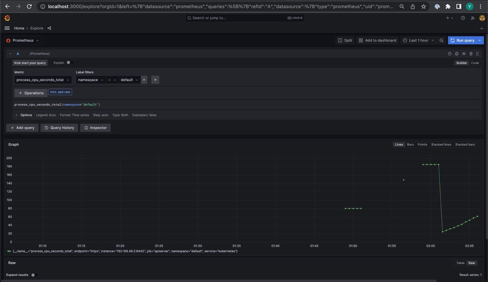
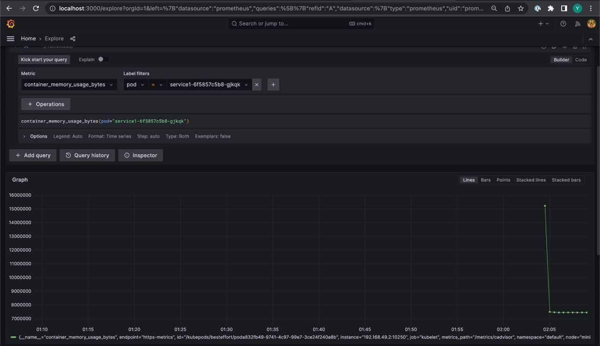
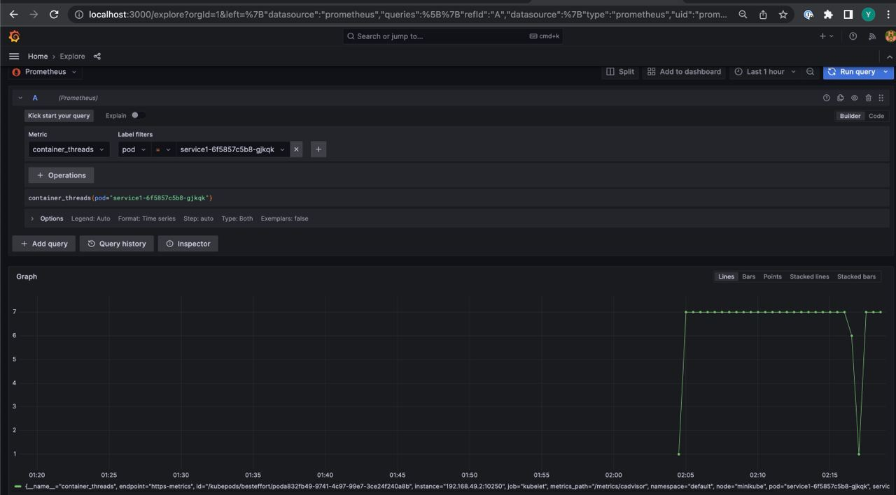
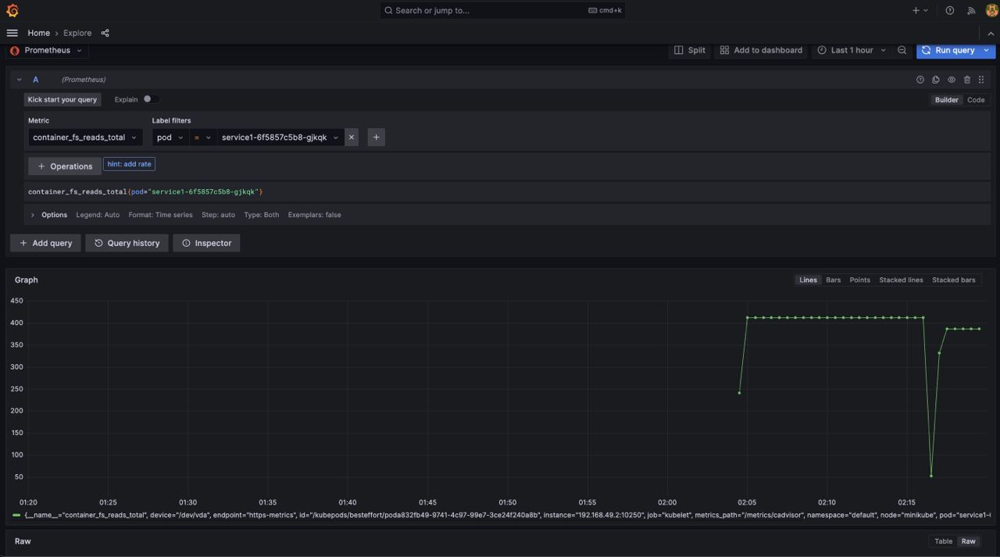

`minikube addons enable metrics-server`

`kubectl create namespace monitoring`

`helm repo add prometheus-community https://prometheus-community.github.io/helm-charts`

`helm install --namespace monitoring prometheus prometheus-community/kube-prometheus-stack`

`helm install local helm/v5`

`kubectl port-forward --namespace monitoring service/prometheus-grafana 3000:80`

